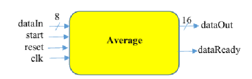
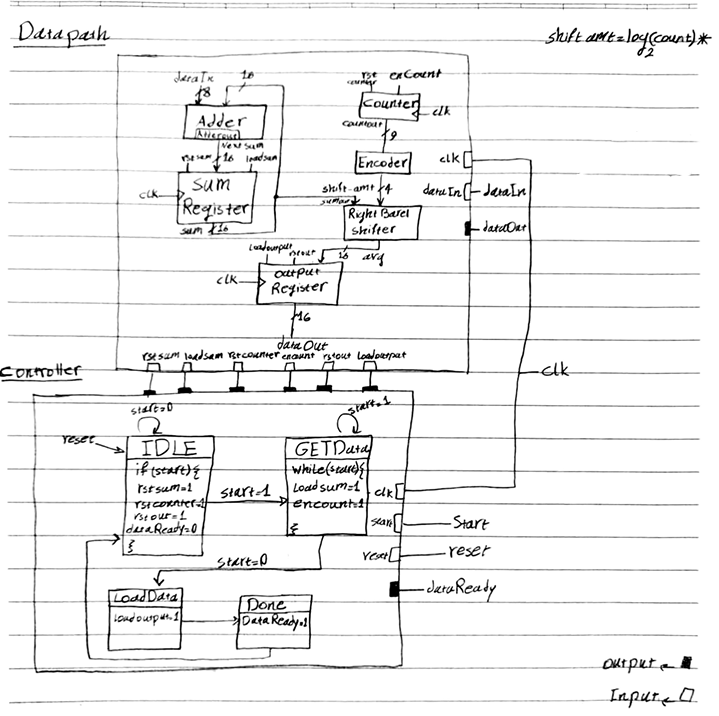
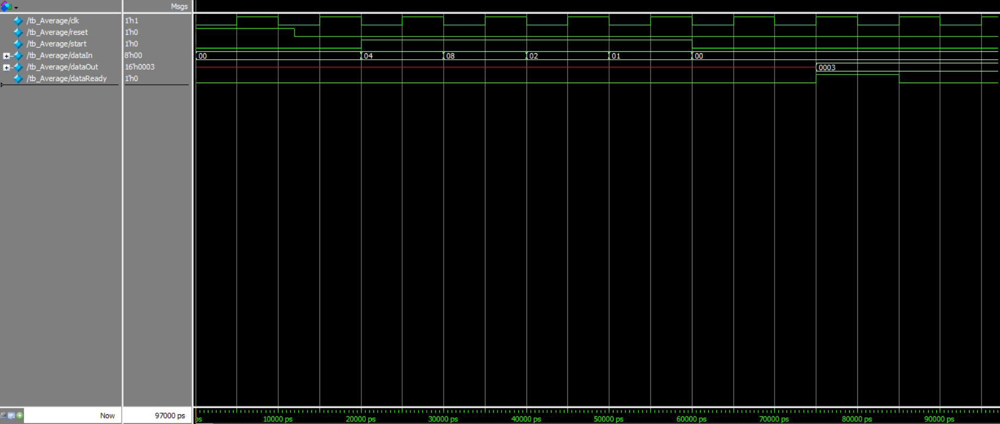

# Hardware-Based Average Calculator (Datapath + FSM Controller)

## 📌 Overview
This project implements a synchronous **Average Calculator System** using Verilog HDL as part of a Digital Design university project. The system architecture follows a structured **Controller-Datapath methodology** to sample, accumulate, and compute the arithmetic mean of an incoming stream of 8-bit integer values.

The architecture takes advantage of behavioral modeling optimizations: since the total number of input samples is always a **power of 2** (up to a maximum of 256 samples), the synthesis tool automatically optimizes the high-level division operator into an efficient, low-latency **hardware right-shift implementation**, eliminating the need for a bulky and resource-heavy structural hardware divider.

---

## 🔲 Top-Level Block Diagram

Below is the official top-level block diagram and interface pin configuration of the encapsulated module:



### 🎛️ Module Inputs and Outputs

| Signal Name | Direction | Width | Description |
| :--- | :--- | :--- | :--- |
| **`clk`** | Input | 1-bit | System master clock driving all synchronous transitions. |
| **`reset`** | Input | 1-bit | Active-high system reset to clear registers and initialize the FSM. |
| **`start`** | Input | 1-bit | High-asserted control window that enables synchronous data collection. |
| **`dataIn`** | Input | 8-bit | Input data bus carrying the serial stream of integer values. |
| **`dataOut`** | Output | 16-bit | Output bus holding the final calculated average result. |
| **`dataReady`** | Output | 1-bit | Status flag asserted high to indicate that the valid average is available. |

---

## 📐 Circuit Architecture & Implementation

The system strictly segregates the control plane from the data plane to achieve clean synthesis and avoid timing anomalies:

### 1. Datapath Unit (`AveDatapath`)
The datapath performs all arithmetic and data routing operations under the guidance of the controller:
* **Adder & Sum Register:** A 16-bit accumulator tracking the running total without overflow.
* **Counter:** Dynamically increments with every incoming sample during the collection phase to track the number of samples.
* **Smart Synthesis Optimization:** Instead of manually cascading logical gates for a structural divider circuit, the behavioral division operator (`/`) was used. Because the dataset size is strictly restricted to a power of 2 ($2^n$), the synthesis tool automatically maps this operator directly into a zero-cost **Right Barrel Shifter** hardware primitive, ensuring high-speed execution while keeping the structural code clean and readable.
* **Output Register:** Latches the final shifted average to keep `dataOut` completely stable.

### 2. Control Unit (`AveController`)
The controller is implemented as a synchronous **Finite State Machine (FSM)** tracking 4 primary states:
* **`IDLE`:** The system initializes internal registers and waits for the `start` signal to go high.
* **`GETData`:** While `start` remains high, the datapath continuously accumulates incoming `dataIn` tokens and increments the sample counter on every clock edge. 
  * *Design Note:* Control lines `loadsum` and `encount` are directly gated with the `start` window to prevent an extra "zero data/ghost token" from being registered during the boundary transition out of this state.
* **`LoadData`:** The calculated average is safely loaded from the shifter into the output register.
* **`Done`:** The FSM asserts the `dataReady` signal high. The system holds the average on the bus before returning cleanly to `IDLE`.

---

## 📊 Controller and Datapath Diagram

Below are the internal structural schematics and layout manuscripts mapping out the Datapath components and FSM transitions:



---

## 💻 Testbench & Verification

The correctness of the hardware layout was verified using a custom testbench (`tb_Average`) simulated in **ModelSim**.

### Test Scenario Stimulus
* **Input Sequence:** Loaded four decimal values sequentially: `4`, `8`, `2`, and `1`.
* **Hardware Math:** Cumulative Sum = `15` ($4+8+2+1$) | Total Count = `4` ($2^2$).
* **Expected Formula Outcome:** $$\text{Average} = \frac{15}{4} = 3$$

### 📺 Waveform Output
The behavioral simulation confirmed the correct operation. As soon as `start` drops and `dataReady` transitions high, the output bus perfectly stabilizes and holds the exact hexadecimal value `16'h0003` sustainably across the clock edge without any delta-cycle race conditions:



---

## 📁 File Structure

```text
├── src/
│   ├── Average.v          <-- Top-level wrapper module connecting controller & datapath
│   ├── AveController.v    <-- FSM Control Unit implementing the 4-state logic
│   └── AveDatapath.v      <-- Data plane handling addition, counting, and division
├── testbench/
│   └── tb_Average.v       <-- Simulation driver matching the university timing specification
└── docs/
    ├── average_block_diagram.png <-- Top-level block diagram from assignment sheet
    ├── architecture_diagram.jpg  <-- Internal FSM & datapath schematics
    └── waveform.png              <-- ModelSim waveform screenshot

```

---

## 🎓 What I Learned

Through this project, I gained hands-on engineering experience in:

* Implementing the **Controller-Datapath** methodology for practical digital systems.
* Managing synchronous FSM state transitions and register-load timings in Verilog.
* Understanding how modern synthesis compilers optimize high-level operators (like `/`) into specific hardware primitives (like shifters) based on architectural constraints.
* Writing modular testbenches and analyzing digital wave profiles within **ModelSim**.

---

**Author:** Bahar Abouali

**Focus:** Computer Engineering Student | Verilog HDL, Digital Logic Design, FSM Modeling, Hardware Architecture